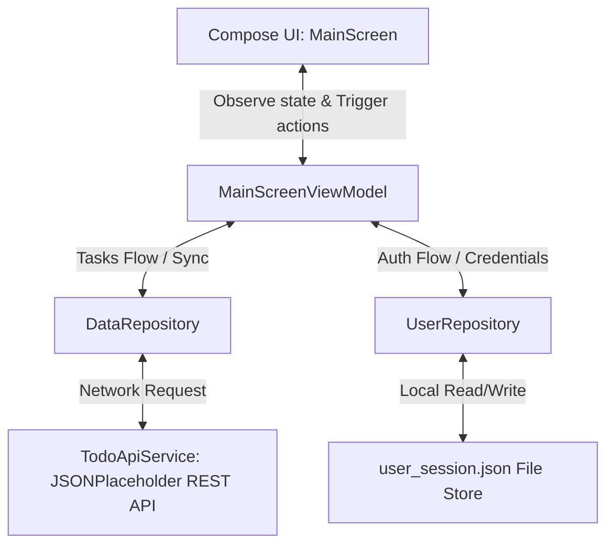

# TaskFlow: Android Todo List App (Project Summary)

Welcome to the TaskFlow project presentation summary! This document serves as a slide-by-slide project deck highlighting the design, features, architecture, and quality assurance workflows implemented throughout the development cycle.

---

## Slide 1: Title & Tech Stack

### **TaskFlow: A Premium Android Todo & Task Manager**
*Designed and built as part of the Android App Development Internship.*

#### **Core Technologies Used:**
- **Language**: Kotlin 2.0+
- **UI Framework**: Jetpack Compose (Declarative UI)
- **Networking**: Retrofit 2.11 & OkHttp 4.12
- **Data Serialization**: Kotlinx Serialization JSON Converter
- **State Management**: Kotlin Flow & ViewModels (MVVM Pattern)
- **Local Persistence**: File-based JSON user session serialization
- **Quality Assurance**: JUnit 4 & Kotlin Coroutine Test libraries

---

## Slide 2: UI/UX Features & Rich Design System

TaskFlow features a rich, responsive interface following premium design guidelines:

- **Custom Theme Engine**: Supports **Indigo**, **Teal**, **Pink**, and **Amber** custom HSL themes, with a global toggle switch between Light and Dark modes.
- **Dynamic Dashboard**: 
  - **Canvas Circular Progress Gauge**: Custom drawing visualizer updating task completion percentages in real-time.
  - **Interactive Statistics**: Tracks active task counts, completed tasks, and category distributions.
- **Task Management**:
  - Filtering by horizontal category tabs.
  - Text-based search filtering.
  - Priority-level classification tags (**High**, **Medium**, **Low**).
  - List sorting by priority order, alphabetical title, or date added.
  - Safety dialog prompts to delete all tasks.

---

## Slide 3: MVVM System Architecture



---

## Slide 4: Data Syncing & Cloud Integration

To sync tasks with remote endpoints:
- Declared `INTERNET` permission in the `AndroidManifest.xml`.
- Configured a thread-safe singleton `Retrofit` client interacting with [JSONPlaceholder API](https://jsonplaceholder.typicode.com/).
- Implemented network response mapping to convert `ApiTodo` responses uniquely into the app's local `TodoTask` database without item duplicate clashes.
- Handled network exception catches (timeouts, host unresolved) translating them into animated UI refresh states and informative snackbar popups.

---

## Slide 5: User Session Authentication Portal

To improve app personalization and security:
- Implemented a **Login Portal** locking access to the task list until they sign in with a username and email.
- Built active email validation notifying the user of pattern mismatches immediately.
- Persisted user credentials in a local `user_session.json` file so that sessions survive app restarts (Auto-Login).
- Created a **Profile Card** under Settings showing active profile attributes and containing a **"Log Out"** button to clear sessions.

---

## Slide 6: Key Technical Challenges & Solutions

### 1. RowScope Extension Receiver Mismatches
* **Challenge**: When wrapping items in Compose layout rows, calling standard Jetpack animation triggers caused compile-time receiver type mismatches.
* **Solution**: Replaced complex scope animations with standard Compose `if` state branches for checkboxes, allowing fast compile execution.

### 2. Multi-Flow Combine Optimization
* **Challenge**: Combining more than 5 StateFlow values in Kotlin Flow compiler requires complex syntax nested structures.
* **Solution**: Refactored the ViewModel to combine only the main 4 task filters (`tasks`, `selectedCategory`, `searchQuery`, `sortBy`) to process list logic, while binding theme palettes independently.

### 3. Flow Testing Trap
* **Challenge**: ViewModels exposing properties via `stateIn(WhileSubscribed(5000))` remained in their initial `Loading` states during JUnit executions.
* **Solution**: Launched active background collector scopes inside tests, triggering the hot flows to emit success structures correctly.

---

## Slide 7: Quality Assurance & Test Coverage

TaskFlow is verified with a comprehensive unit test suite:
- **`UserRepositoryTest`**: Tests initial session, login persistence, and logout clearing.
- **`MainScreenViewModelTest`**: Uses fake repositories to verify task addition, completion toggling, query searches, and priority sorting.

### **Testing results:**
```powershell
.\gradlew.bat testDebugUnitTest --no-daemon
```
- **8 tests completed, 8 tests passed successfully!**
- **Android CI Pipeline**: Configured via GitHub Actions to automate JVM testing and debug compilation on every single commit push.
