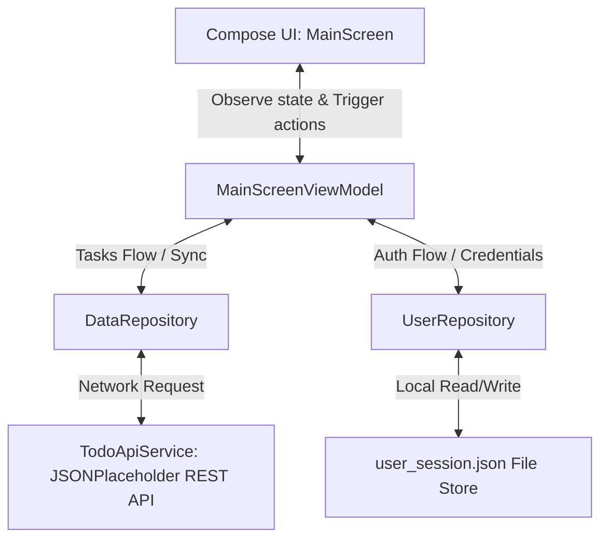

# TaskFlow - Android Studio Internship Portfolio

[](https://kotlinlang.org/)
[](https://developer.android.com/jetpack/compose)
[](https://square.github.io/retrofit/)
[](https://github.com/features/actions)

Developed and maintained by **Dhanish Ladwani** ([@dhanish0711](https://github.com/dhanish0711/)).

This repository contains the complete projects, source files, test suites, CI/CD pipelines, and detailed documentation completed during the App Development Internship.

---

## 📂 Repository Structure

The repository is structured as follows:
- **`app/`**: The core Android application module containing Kotlin source codes, resource configurations, and test suites.
- **`tasks/`**: A dedicated folder containing individual documentation for each internship milestone:
  - 📝 **[Task 1: Onboarding and Environment Setup](tasks/TASK_1.md)** - Initial project initialization and layout structure.
  - 📝 **[Task 2: Designing and Implementing UI/UX](tasks/TASK_2.md)** - Custom HSL themes, canvas gauges, sorting, and filters.
  - 📝 **[Task 3: Backend Integration and API Development](tasks/TASK_3.md)** - Retrofit client, OkHttp builder, mapping and remote sync.
  - 📝 **[Task 4: Advanced Features and Testing](tasks/TASK_4.md)** - File-persisted user logins, email pattern validation, and test suites.
  - 📝 **[Task 5: Finalization, Deployment, and Presentation](tasks/TASK_5.md)** - GitHub Actions CI/CD workflow, final documentation, and presentation slide summary.

---

## 🛠️ Environment Setup & Installation Guide

To load and run this application locally, ensure you have the following configurations:

### 1. Install Java Development Kit (JDK)
Install JDK 17 or higher (the project is configured to build on JDK 17). Verify compilation target:
```bash
java -version
```

### 2. Install Android Studio
- Download and install the latest stable version of **Android Studio**.
- Ensure Android SDK Platform 36 and Android SDK Build-Tools are installed through the SDK Manager.

### 3. Load Project in Android Studio
1. Open Android Studio.
2. Select **Open Project** and navigate to this repository directory.
3. Allow Gradle to sync and fetch all dependencies (Retrofit, OkHttp, Serialization).

### 4. Build and Run Project (CLI Commands)
You can compile and test the app using Gradle commands from the root directory:
* **Run JVM Unit Tests**:
  ```powershell
  ./gradlew testDebugUnitTest
  ```
* **Build Debug APK Package**:
  ```powershell
  ./gradlew assembleDebug
  ```

---

## 📱 Project Showcase: TaskFlow (Todo App)

**TaskFlow** is a premium task manager application built entirely with **Kotlin** and **Jetpack Compose** (Material 3).

### Key Features:
- **Dashboard Progress Card**: Live-updated custom Canvas circular progress gauge visualizer.
- **Interactive Checkboxes**: Click-to-complete tasks with responsive state transitions.
- **Category Filter Chips**: Scrollable filter chips (All, App Dev, Personal, Study, Cloud) to isolate task cards.
- **Multi-Theme Palettes**: Light/Dark theme switch with 4 custom HSL color options (Indigo, Teal, Pink, Amber).
- **Search & Sort Pipeline**: Instantly search task title strings and sort list contents by Priority levels, alphabetical Order, or date Created.
- **Mock REST API Syncing**: Pulls task elements from [JSONPlaceholder API](https://jsonplaceholder.typicode.com/) and maps them uniquely to local data lists with full network state handlers and Snackbar notification alerts.
- **User Authentication**: Styled Login screen with regex-based active email validation and file-based session persistence.

---

## 🏗️ Architecture Design

The app's components follow the Model-View-ViewModel (MVVM) design architecture:



---

## 🚀 Continuous Integration / Continuous Deployment (CI/CD)
TaskFlow integrates **GitHub Actions** (`.github/workflows/android-ci.yml`) to automatically compile the repository and run all JUnit test suites on every branch push, verifying code quality before builds are deployed.

---

## 🏆 Completed Internship Milestones
- [x] **Task 1**: Onboarding, Environment Setup & TaskFlow App.
- [x] **Task 2**: Designing and Implementing UI/UX.
- [x] **Task 3**: Backend Integration and API Development.
- [x] **Task 4**: Advanced Features and Testing.
- [x] **Task 5**: Finalization, Deployment, and Presentation.
